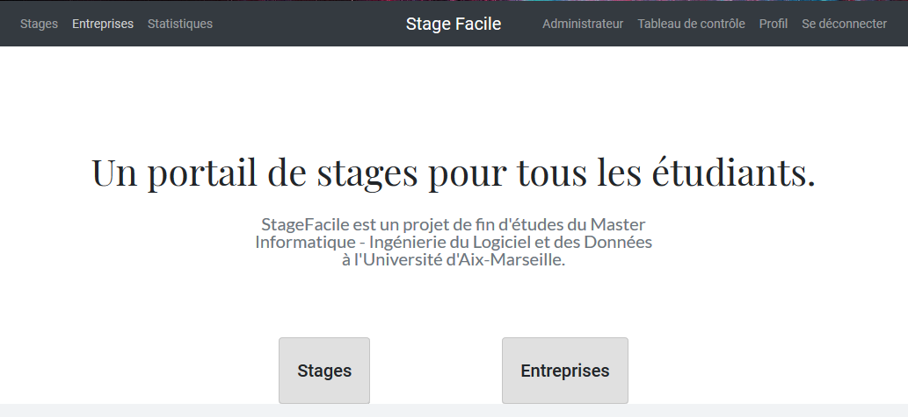
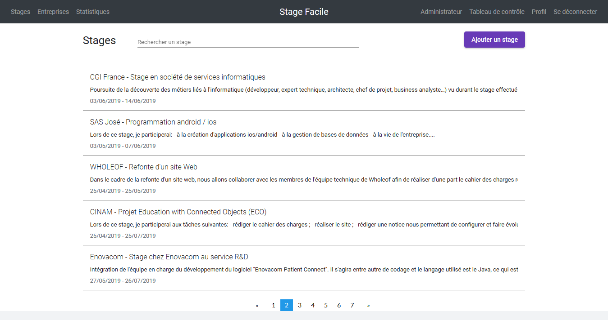
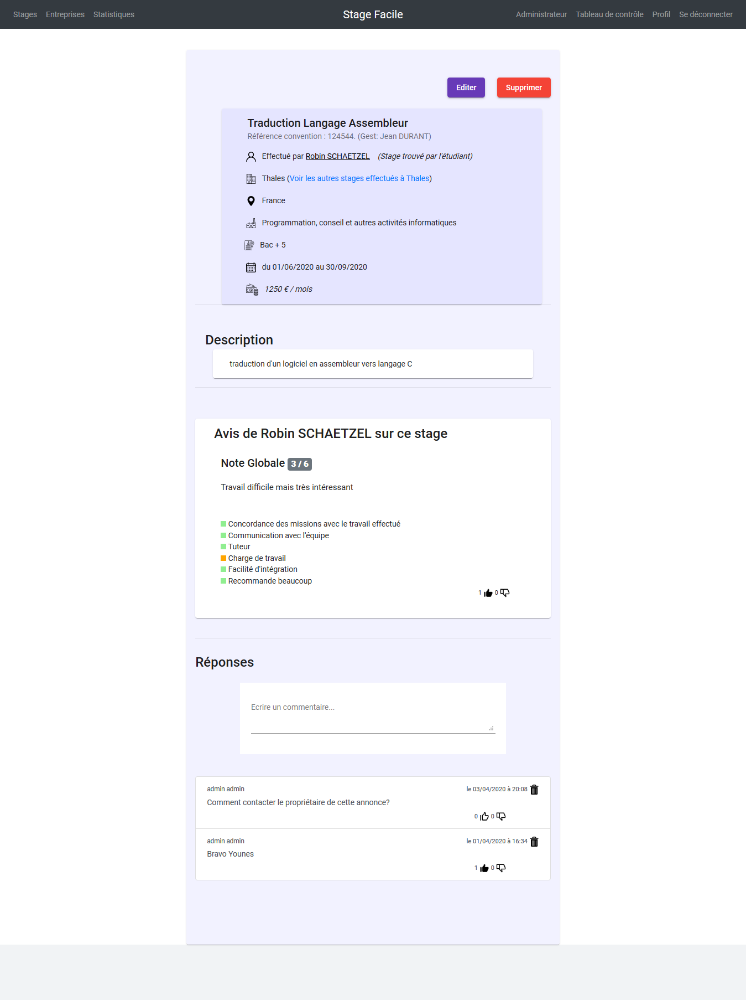
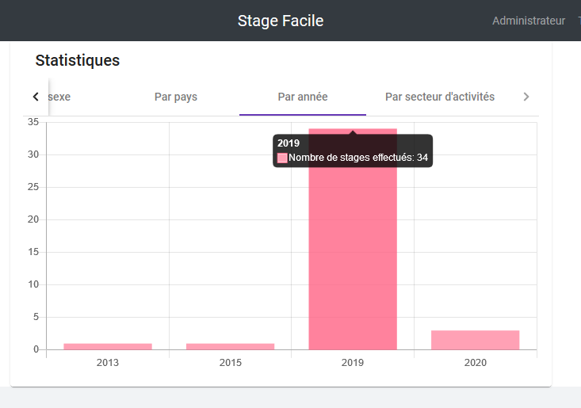

<!--
*** Thanks for checking out this README Template. If you have a suggestion that would
<!-- PROJECT LOGO -->
<br />
<p align="center">
  <a href="https://github.com/younesyu/stage_facile">
    
  </a>

  <h3 align="center">Stage facile</h3>

  <p align="center">
    Une application web full-stack écrite en Java (Spring) et en TypeScript (Angular).
    <br />
    <a href="https://github.com/younesyu/stage_facile"><strong>Explorer la doc »</strong></a>
    <br />
    <br />
    <a href="https://heroku-stagefacile.herokuapp.com/api/test/all">Lancer le serveur (Cliquer pour accéder aux fonctionnalités du sites</a>
    ·
    <a href="https://stage-facile.firebaseapp.com">Lien vers l'application</a>
    ·
    <a href="https://github.com/younesyu/stage_facile/issues">Rapporter un Bug</a>
    ·
    <a href="https://github.com/younesyu/stage_facile/issues">Demander une fonctionnalités</a>
  </p>
</p>


<!-- TABLE OF CONTENTS -->
## Table des matières

* [A Propos du Projet](#about-the-project)
  * [Built With](#built-with)
* [Screenshots](#screenshots)
* [Getting Started](#getting-started)
  * [Prerequisites](#prerequisites)
  * [Installation](#installation)
* [Contact](#contact)


<!-- ABOUT THE PROJECT -->
## A Propos du Projet

 Un portail de stages pour tous les étudiants.
StageFacile est un projet de fin d'études du Master Informatique - Ingénierie du Logiciel et des Données à l'Université d'Aix-Marseille. 


### Built With

* Java
  * Spring (Spring Data, Spring Security)
  * JPA
  * H2, PL/SQL
  * Hibernate
  * Tomcat
* TypeScript
  * Angular
* JavaScript
  * Chart.js
* CSS
  * Bootstrap
  * Angular Material

<!-- IMAGES -->
## Screenshots








<!-- GETTING STARTED -->
## Getting Started

To get a local copy up and running follow these simple steps.

### Prerequisites

* Eclipse

### Installation
 
1. Cloner le repo stage_facile
```sh
git clone https://github.com/younesyu/stage_facile.git
```
2. Installer les NPM packages
```sh
cd frontend
npm install
```
3. Lancer le serveur Java
4. Lancer le serveur Angular


<!-- CONTACT -->
## Contact

Younes Rouabhia - younesrouabhia@gmail.com

Project Link: [https://github.com/younesyu/stage_facile](https://github.com/younesyu/stage_facile)
